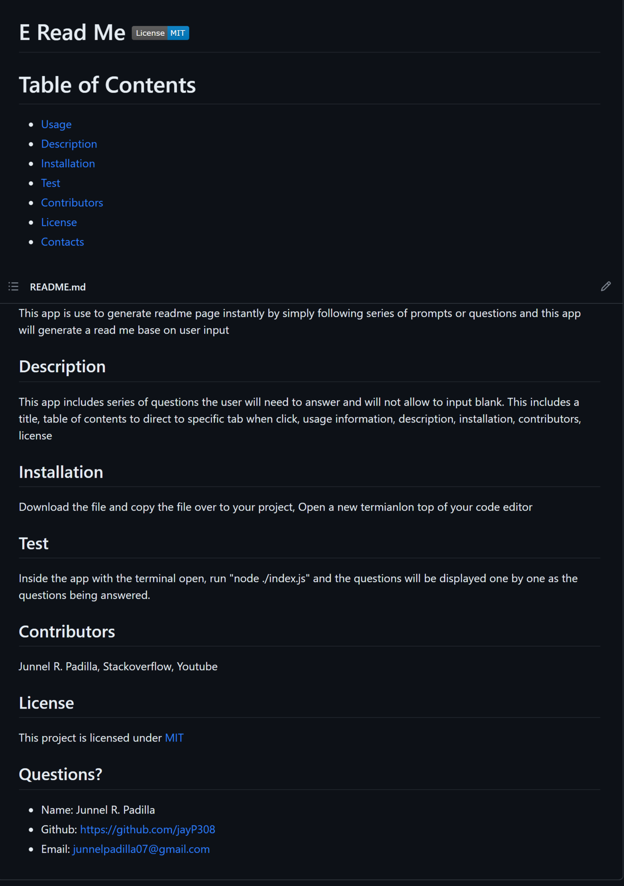

# E-Read-Me 

# Table of Contents
* [Usage](#usage)
* [Description](#usage)
* [Installation](#installation)
* [Test](#test)
* [Contributors](#contributors)
* [License](#license)
* [Questions](#questions)
 
## Usage
This app is use to generate readme page instantly by simply following series of prompts or questions and this app will generate a read me base on user input.
 
## Description
This app includes series of questions the user will need to answer and will not allow to input blank. This includes a title, table of contents to direct to specific tab when click, usage information, description, installation, contributors, license and where to contact user. Simply answer each questions and the license part will make you choose a type of license that are available to use. After submitting, a message will be display that readme page has been created and a new file will be added as README.md.
 
## Installation
Repo Link: https://github.com/jayP308/e_read_me

- Click on the my repository link above
- Click on the green button that says 'Code'
- Copy the SSH link
- Open Terminal, GitBash, or Powershell
- You may create a separate folder to clone the repo
- Inside the folder(if you created one), git clone 'ssh link'
- You can either run the app through terminal or code editor
- Type in 'node index.js' and the app will run (Video Tutorial link will be under Test section)

## Test
Inside the app with terminal open, run "node index.js" and the questions will be displayed one by one as the questions being answered.

Video Tutorial Link: https://drive.google.com/file/d/1GCLfjexGRXFVE-uuZRtDPYtL7poXLTTy/view

Sample Readme Page Generated Through App

 
## Contributors
Junnel R. Padilla, Stackoverflow, Youtube.
 
## License
This project is licensed under [MIT](https://opensource.org/licenses/MIT)

## Questions?
* Name: Junnel R. Padilla (JP)
* Github: https://github.com/jayP308
* LinkedIn: https://www.linkedin.com/in/jp-padilla-038854251/
